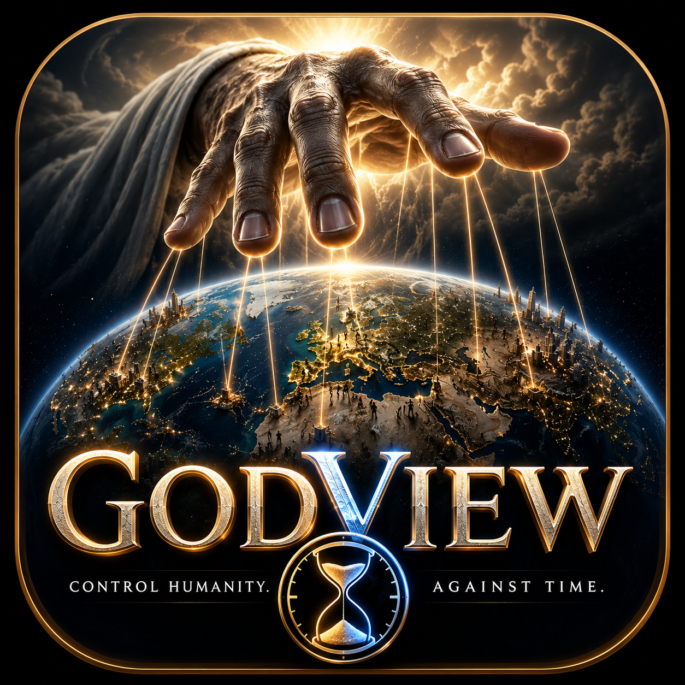

<p align="center">
  
</p>

<h1 align="center">GodView</h1>

<p align="center">
  <em>A god-view, globe-based macroeconomics simulator.</em><br>
  Set each country's economic levers — interest rate, tariffs, taxes, spending —
  and watch a fully-coupled model ripple through GDP, inflation, FX, trade,
  employment, inequality and public approval, week by week, on a live 3D Earth.
</p>

<p align="center">
  <a href="https://godview.hexadevit.com/"></a>
  
  
  
  
</p>

<p align="center">
  <strong>🌐 Live demo: <a href="https://godview.hexadevit.com/">godview.hexadevit.com</a></strong>
</p>

> **Note:** The in-app UI is **multilingual** — Portuguese, English and Spanish,
> auto-detected from the browser and switchable in-app. The model is a *stylized,
> educational* simulation — directionally sensible, **not predictive**.

---

## What it is

GodView is a client-side "god view" strategy sandbox. You pick a country on a 3D
globe, adjust its macro policy levers, and a tick engine (**1 tick = 1 simulated
week**) propagates the effects across every country through a damped
*influence network* — every variable reads the state of all the others, with the
damping and clamps tuned so the system converges instead of exploding.

The demonstrable causal chain baked into the engine:

```
↑ policy rate → currency appreciates → exports fall → GDP growth cools → inflation cools
```

Everything runs in the browser. **There is no backend** — the simulation executes
in a Web Worker and all data ships as static, version-controlled snapshots.

## Features

- **Interactive 3D globe** (`react-globe.gl` / three.js) with multiple base maps:
  Political, Relief ×10, Satellite, Day/Night ("Agora"), Night lights, Hydrographic.
- **9 economic metrics** color-mapped onto countries: GDP (power), GDP per capita,
  population, growth, inflation, unemployment, inequality, education, approval.
- **Infrastructure layers** you can toggle: air / sea / road / rail routes (real
  geometry), cities, submarine cables, waterways, datacenters, satellites (live
  TLE positions), real-time-ish clouds, and a procedural sky with a correctly
  positioned Sun and Moon.
- **Playable scenarios**: Sandbox (today), Trade War, Inflation Shock, Stagflation,
  Oil Shock — each with an objective and starting conditions.
- **Timeline controls**: play / pause / speed, with time-series charts (Recharts).
- **Per-country panel** to adjust levers and see the internal transport mesh.
- **Real starting data** — a World Bank macro snapshot plus real transport routes
  (sea lanes via `searoute`, great-circle air routes), bilateral trade, and more.
- **Multilingual UI** — Portuguese, English and Spanish, auto-detected from the
  browser and switchable in-app, including localized country names.

## The simulation model

A small, **damped subset** of the "everything influences everything" model. Each
tick, every variable moves a fraction of the way toward a target computed from the
whole world state, then is clamped to a sane range — making the update a
contraction toward bounded equilibria. Modeled blocks include FX, trade balance,
growth (monetary + fiscal + trade + risk), unemployment (Okun's law), inflation
(Phillips via output *and* unemployment gaps + imported/commodity pass-through),
sovereign risk spread, fiscal balance & debt dynamics, inequality, poverty,
public approval (the game "score"), social unrest, education, and a composite
wellbeing index. See [src/sim/engine.ts](src/sim/engine.ts) and the design study
in [plan.md](plan.md) (§4).

## Tech stack

| Area | Choice |
|---|---|
| UI | React 19 + TypeScript |
| Build | Vite 6 |
| Styling | Tailwind CSS 4 |
| Globe / 3D | `react-globe.gl`, `three` |
| Charts | Recharts |
| UI primitives | Radix UI (dialog, popover, slider) |
| Simulation | Plain-TS tick engine in a Web Worker |
| Satellites | `satellite.js` (TLE propagation) |
| Sea routes | `searoute-js` |
| Tests | Vitest |

## Getting started

Requires **Node 20+**.

```bash
npm install
npm run dev        # start the dev server → http://localhost:5163
```

Other scripts:

```bash
npm run build      # type-check + production build → dist/
npm run preview    # serve the production build locally
npm run test       # run the Vitest suite
```

## Data pipeline

All runtime data lives as static `.ts`/JSON snapshots under [src/data/](src/data/),
generated offline by the ingestion scripts in [scripts/](scripts/) — they are
**build-time only** and never run in the browser:

| Script | Produces |
|---|---|
| `npm run ingest` | G20 macro snapshot (World Bank: GDP, inflation, debt, population, …) |
| `npm run ingest:trade` | Bilateral trade matrix (UN Comtrade) |
| `npm run ingest:searoute` | Real maritime routes through canals & straits |
| `npm run ingest:roads` | Road / rail corridors |
| `npm run ingest:air` | Great-circle air routes between airports |
| `npm run ingest:cities` | City coordinates & population |

The UN Comtrade ingest needs an API key. Create a `.env` (git-ignored) with:

```
COMTRADE_KEY=your_key_here
```

This key is used **only** by the offline scripts — it is not `VITE_`-prefixed and
never reaches the client bundle.

## Project structure

```
src/
  App.tsx            # top-level shell: metric/layer/scope/basemap controls
  main.tsx           # entry point
  globe/             # GlobeView, route geometry, shaders, metric scales
  sim/               # tick engine, types, Web Worker, tests
  panels/            # country panel, world table, timeline, legend
  i18n/              # i18n dictionary (pt/en/es) + localized country names
  state/             # simulation context/store
  data/              # generated static snapshots (countries, trade, routes…)
  assets/textures/   # bundled Earth / cloud / moon textures
scripts/             # offline data-ingestion scripts
plan.md              # product plan & feasibility study (pt-BR)
```

## Deployment (Cloudflare Workers Static Assets)

Live at **[godview.hexadevit.com](https://godview.hexadevit.com/)**.

The app is a fully static SPA — no server, no backend. It's served via
**Cloudflare Workers Static Assets** (assets-only, no Worker script), configured
entirely in [wrangler.toml](wrangler.toml):

```toml
name = "godview"
compatibility_date = "2026-07-06"

[assets]
directory = "./dist"
not_found_handling = "single-page-application"  # SPA routing fallback
```

**Git-connected (push-to-deploy):** the GitHub repo is connected in the Cloudflare
dashboard (Workers & Pages). On every push to `main`, Cloudflare runs `npm run build`
(Node pinned by [.node-version](.node-version)) then `npx wrangler deploy`, which
uploads `./dist`.

**Manual deploy:**

```bash
npm run build
npx wrangler deploy      # requires `wrangler login` or CLOUDFLARE_API_TOKEN
```

> Your `.env` (`COMTRADE_KEY`) is git-ignored and only used by the offline ingest
> scripts — it never reaches the client bundle, so nothing secret is published.

## Status

Prototype #1 is built and playable. The main open risk is **model calibration** —
keeping the fully-coupled influence network stable and sensible as more real
relationships are added (see `plan.md` §4.2, "Fase 1.5"). The model is intended
for visualization, strategy and teaching — **not economic forecasting**.
